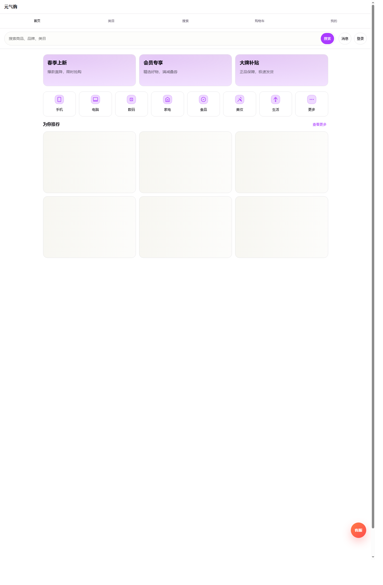
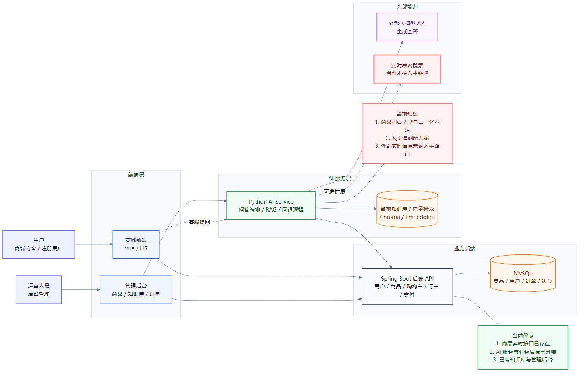
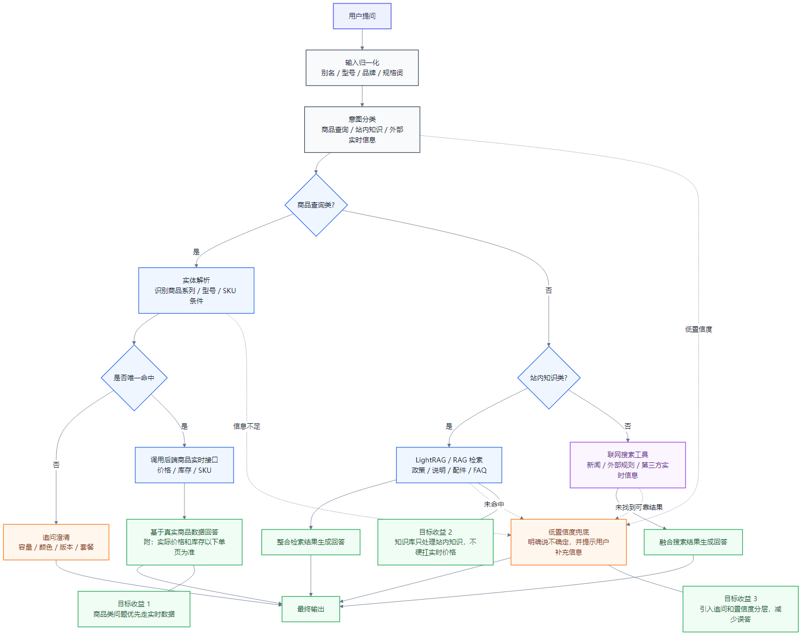

# ProjectKu Web

ProjectKu Web is a full-stack e-commerce project with product catalog, cart, orders, coupons, after-sales flows, reviews, wallet balance, and an AI customer-service knowledge base.




## Highlights

- Storefront frontend built with Vue 3 and Vite
- Backend API built with Spring Boot 3, MyBatis, and MySQL
- AI customer service built with FastAPI, RAG retrieval, and realtime product lookup
- Knowledge-base admin with document ingest, indexing, hit logs, and miss logs
- LightRAG integration path with Neo4j and PostgreSQL/pgvector

## Tech Stack

- Frontend: Vue 3, TypeScript, Pinia, Vite
- Backend: Java 17, Spring Boot 3, MyBatis
- AI service: Python, FastAPI, Chroma, LightRAG, Neo4j
- Infra: Docker Compose, Nginx, MySQL 8, PostgreSQL/pgvector

## Repository Layout

```text
frontend/      Vue storefront
back/          Spring Boot backend
ai-service/    AI customer-service and knowledge-base service
deploy/        Production deployment templates and scripts
docs/          Design, deployment, API, and KB docs
scripts/       Local helper and validation scripts
```

## Architecture

### Current system



### AI customer-service target flow



## Local Development

### One-command startup

Windows PowerShell:

```powershell
.\start_all.ps1 -Mode dev -InstallAiDeps -SeedAiKb
```

Linux / macOS:

```bash
./start_all.sh dev --install-ai-deps --seed-ai-kb
```

Default local URLs:

- Frontend: `http://127.0.0.1:5173`
- Backend: `http://localhost:8080/api`
- AI service: `http://127.0.0.1:9000/health`

Frontend text-encoding regression check:

```bash
node scripts/verify_frontend_text_encoding.js
```

### Manual startup

1. Start MySQL and import `back/sql/init_db.sql`
2. Start backend:

```bash
cd back
mvn spring-boot:run
```

3. Start AI service:

```bash
cd ai-service
python -m pip install -r requirements.txt
python -m uvicorn app.main:app --host 127.0.0.1 --port 9000 --reload
```

4. Start frontend:

```bash
cd frontend
npm install
npm run dev
```

## Production Deployment

The repo now includes a reusable GitHub-friendly deployment entrypoint:

```bash
cp deploy/prod.env.example deploy/prod.env
cp deploy/ai-service.env.example deploy/ai-service.env
./deploy/prepare_lightrag_env.sh
./deploy/bootstrap-prod.sh
```

See:

- `deploy/README.md`
- `docs/deployment.md`

## Repository Automation

- GitHub Actions CI runs frontend install, production build, and frontend text-encoding regression checks.
- Public issue intake is structured with bug-report and feature-request templates.

Recommended production stack:

- Nginx for frontend entry
- Spring Boot backend with `prod` profile
- FastAPI AI service
- MySQL 8
- Neo4j 5
- PostgreSQL with pgvector
- LightRAG in staged rollout mode

## Main Views

- Home: `frontend/src/views/HomeView.vue`
- Product detail: `frontend/src/views/ProductDetailView.vue`
- Cart: `frontend/src/views/CartView.vue`
- Knowledge base admin: `frontend/src/views/KnowledgeBaseAdminView.vue`

## Main APIs

- Products: `/api/v1/products`
- Orders: `/api/v1/orders`
- Payments: `/api/v1/payments`
- AI chat: `/api/v1/customer-service/chat`

OpenAPI:

- Swagger UI: `http://localhost:8080/api/swagger-ui-custom.html`
- OpenAPI JSON: `http://localhost:8080/api/api-docs`

## Related Docs

- `docs/api-contract.md`
- `docs/ai-service-runbook.md`
- `docs/ai-customer-service-knowledge-base-design.md`
- `docs/knowledge-base/2026-04-26-rag-solution-comparison.md`
- `docs/knowledge-base/diagrams/`
- `docs/deployment-faq.md`
- `CONTRIBUTING.md`

## Public Release Notes

- `v0.1.0`: first public release, deployment templates and release packaging
- `v0.1.1`: README visualization, public repository polish, and GitHub-facing deployment entry cleanup
- `v0.1.2`: public repo documentation expansion and deployment FAQ cleanup
- `v0.1.3`: homepage screenshot and frontend encoding regression guard

## Notes

- `deploy/ai-service.env`, `deploy/lightrag.env`, and `deploy/prod.env` are local/server secrets and are intentionally not committed.
- The current release keeps Chroma as the stable retrieval path while allowing staged migration to LightRAG.
- See `NOTICE` for trademark, demo asset, and redistribution caveats.
- `docs/repo-assets/homepage.png` is generated from the local running frontend and can be refreshed after UI updates.
